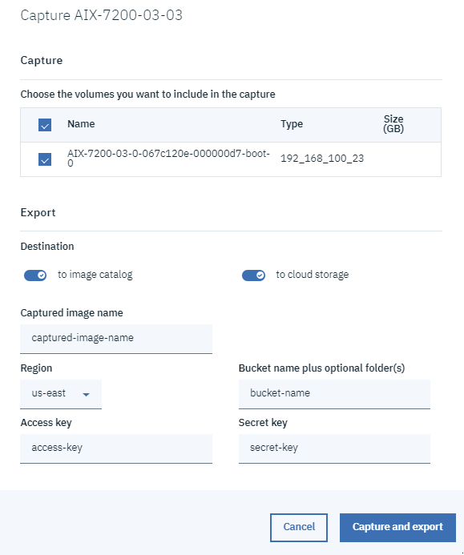

---

copyright:
  years: 2019

lastupdated: "2019-08-16"

---

{:shortdesc: .shortdesc}
{:new_window: target="_blank"}
{:codeblock: .codeblock}
{:pre: .pre}
{:screen: .screen}
{:tip: .tip}
{:important: .important}
{:note: .note}

# Capturing and exporting a virtual machine (VM)
{: #capturing-exporting-vm}

You can capture and export an AIX or IBM i VM instance by using the IBM Cloud CLI or the console. When you capture a VM, you are creating an open virtual application (OVA) from a FlashCopy. FlashCopy enables you to make copies of a set of tracks, with the copies immediately available for read or write access. This set of tracks can consist of an entire volume, a data set, or just a selected set of tracks.
{: shortdesc}

When capturing your VM, you can choose the **image catalog**, **Cloud Object Storage**, or both. The image catalog resides on the IBM Power storage area network (SAN). IBM's **Cloud Object Storage** is encrypted and dispersed across multiple geographic locations, and accessed over HTTP using a REST API. This service makes use of the distributed storage technologies that are provided by the IBM Cloud Object Storage System (formerly Cleversafe). You can always export your image in your **image catalog** to **Cloud Object Storage** at a later point. You can also deploy the captured image to create a clone of the VM by using a different network configuration.

You are charged different rates depending on whether you export to the **image catalog** or **Cloud Object Storage**.
{: important}

## Using the IBM Cloud CLI to capture and export a VM
{: #cli-capture-export}

1. To capture an AIX or IBM i VM, use the `ibmcloud pi instance-capture` command. You can export it to your **image catalog**, **Cloud Object Storage**, or both.

    ```shell
    ibmcloud pi instance-capture INSTANCE_ID --destination DEST --name NAME [--volume-ids "VOLUME1 VOLUME2"] [--access-key KEY] [--secret-key KEY] [--region REGION] [--image-path TYPE]
    ```
    {: codeblock}

2. Find your newly exported image by completing either one of the following tasks:

    - To see your newly exported image in the **image catalog**, use the `ibmcloud pi image-list-catalog` command:

        ```shell
        ibmcloud pi image-list-catalog [--long] [--json]
        ```
        {: codeblock}

    - To see your newly exported image in **Cloud Object Storage**, use the `ibmcloud cos list-objects` command:

        ```shell
        ibmcloud cos list-objects --bucket BUCKET_NAME [--delimiter DELIMITER] [--encoding-type METHOD] [--prefix PREFIX] [--starting-token TOKEN] [--page-size SIZE] [--max-items NUMBER] [--region REGION] [--json]
        ```
        {: codeblock}

For more information on how to use the IBM Cloud CLI to capture and export an image, see the [IBM Power Systems Virtual Servers CLI Reference](/docs/power-iaas-cli-plugin?topic=power-iaas-cli-plugin-power-iaas-cli-reference#power-iaas-cli-before) and [Using the IBM Cloud CLI for Cloud Object Storage](/docs/services/cloud-object-storage?topic=cloud-object-storage-ic-use-the-ibm-cli#delete-bucket-cors).

## Using the IBM Cloud console to capture and export a VM
{: #console-capture-export}

1. Click the **Capture and export** icon under your **Virtual server instance** tab.

    {: caption="Figure 1. Capturing and exporting icon" caption-side="bottom"}

2. Choose the volumes that you want to capture and export.
3. Select whether you want to export the volume to the **image catalog**, **Cloud Object Storage**, or both.
4. Give your captured image a **Name**.
5. _(Optional)_ If you decide to export to **Cloud Object Storage**, you are presented with more options:
   1. Select the **Region**.
   2. Provide your **Access** and **Secret** keys.
   3. Select your **Bucket name** and **optional folders**.

6. Click **Capture and export**.

    {: caption="Figure 2. Capturing and exporting a VM" caption-side="bottom"}

7. If the VM capture and export is successful, you are presented with a confirmation message.

    {: caption="Figure 3. VM capture and export success!" caption-side="bottom"}

8. Find your newly exported image by completing the following tasks:

    - If you chose to capture and export your image to the **image catalog**, go to your **Boot images** tab.

    {: caption="Figure 4. Finding your newly captured image in your image catalog" caption-side="bottom"}

    - If you chose to capture and export your image to **Cloud Object Storage**, go to your **Cloud Object Storage** bucket.

    {: caption="Figure 5. Finding your newly captured image in your Cloud Object Storage bucket" caption-side="bottom"}

If you'd like to export your image from your **image catalog** to **Cloud Object Storage**, select your image and click the **Capture and export** icon.

{: caption="Figure 6. Exporting the image in your image catalog to Cloud Object Storage" caption-side="bottom"}
