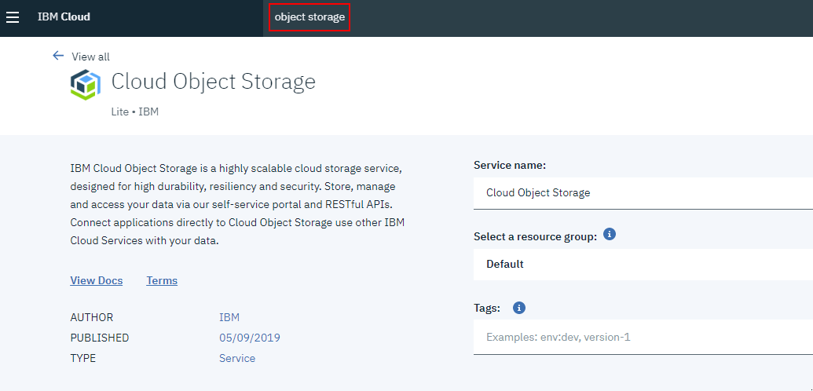
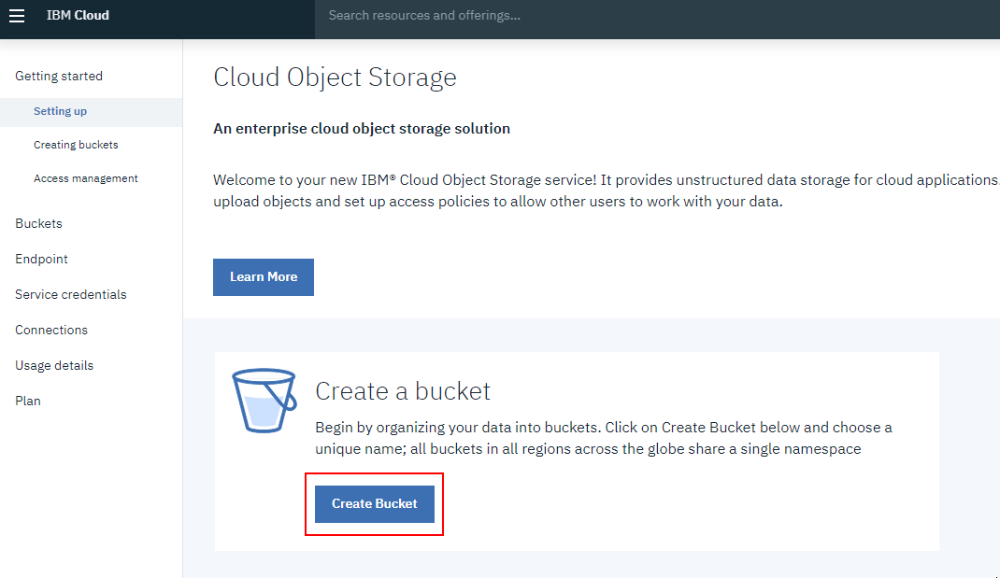
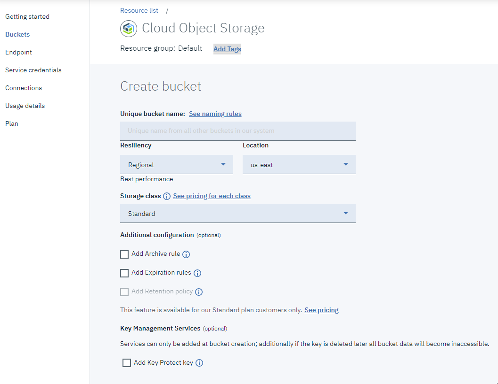
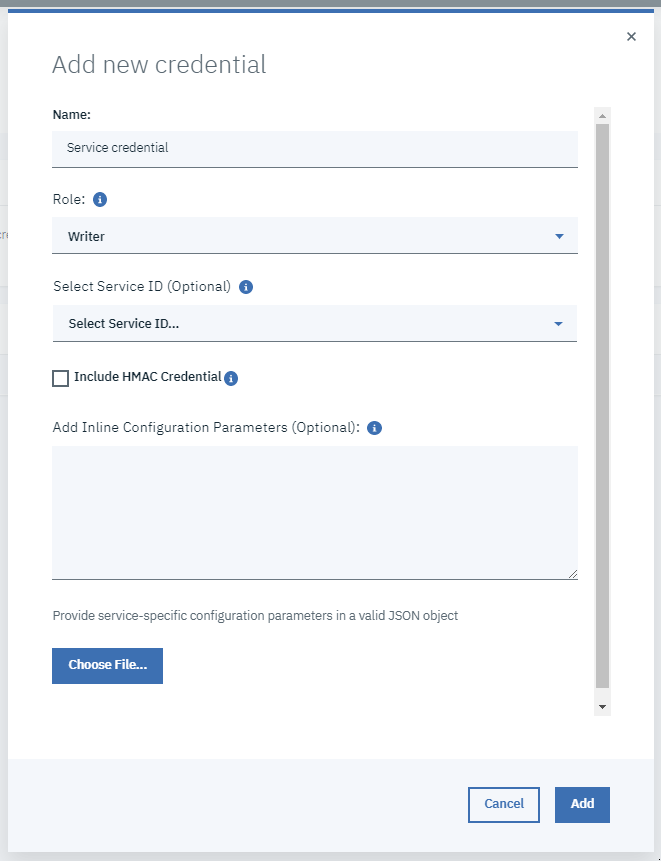
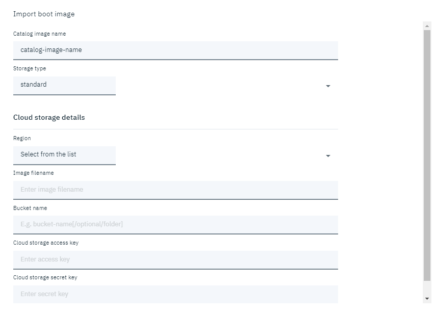

---

copyright:
  years: 2019

lastupdated: "2019-11-05"

keywords: custom image, boot image, upload, deploy

subcollection: power-iaas

---

{:shortdesc: .shortdesc}
{:new_window: target="_blank"}
{:codeblock: .codeblock}
{:pre: .pre}
{:screen: .screen}
{:tip: .tip}
{:note: .note}
{:important: .important}

# Deploying a custom image within a Power Systems Virtual Server
{: #deploy-custom-image}

You can bring your own customized AIX or IBM i operating system (OS) image to deploy within a {{site.data.keyword.powerSysFull}}.
{: shortdesc}

  You cannot transfer an OS license from an on-premises system to a {{site.data.keyword.powerSys_notm}} that is running in the cloud environment. The license cost is factored into the overall hourly billing rate.
  {: note}

## Before you begin
{: #before-you-begin-deploy}

Before you can use a custom image as the boot volume, review the following information:

* You must have a basic understanding of **IBM Cloud Object Storage** concepts. For more information, see [About IBM Cloud Object Storage](/docs/services/cloud-object-storage?topic=cloud-object-storage-about-ibm-cloud-object-storage).
* If you do not have an existing AIX or IBM i image, you can use IBM® PowerVC™ to capture and export an image for use with a {{site.data.keyword.powerSys_notm}}. For more information, see [Capturing a virtual machine](https://www.ibm.com/support/knowledgecenter/en/SSXK2N_1.4.2/com.ibm.powervc.standard.help.doc/powervc_capturing_hmc.html){: new_window}{: external} and [Exporting images](https://www.ibm.com/support/knowledgecenter/en/SSXK2N_1.4.2/com.ibm.powervc.standard.help.doc/powervc_export_image_hmc.html){: new_window}{: external}. You can use the [{{site.data.keyword.cloud}} CLI](https://cloud.ibm.com/docs/cli?topic=cloud-cli-getting-started){: new_window}{: external} to capture a virtual server instance. For more information, see [IBM Power Systems Virtual Servers CLI plug-in](/docs/power-iaas-cli-plugin?topic=power-iaas-cli-plugin-power-iaas-cli-reference#ibmcloud-pi-instance-capture).
* You must verify that your AIX or IBM i OS technology level is supported on the Power Systems hardware that you selected in the **Machine Type** field. To view a list of the supported AIX and IBM i OS technology levels, see the following system software maps:

    Because AIX 6.1 does not support `cloud-init`, you must perform a `mksysb-based` installation of the OS over an existing LPAR that was provisioned.
    {: important}

  **AIX**

    * [S922 (9009-22A) AIX software map ](https://www-01.ibm.com/support/docview.wss?uid=ssm1platformaix9009-22A-all-io)
    * [E880 (9119-MHE) AIX software map ](https://www-01.ibm.com/support/docview.wss?uid=ssm1platformaix9119-MHE-all-io)

  **IBM i**

    * [S922 (9009-22A) and E880 (9119-MHE) software map ](https://www-01.ibm.com/support/docview.wss?uid=ssm1platformibmi)

## Creating an IBM Cloud Object Storage bucket
{: #cloud-storage-bucket}

1. Type **object storage** into the catalog's search box and select **Cloud Object Storage**.

    {: caption="Figure 1. IBM Cloud Object Storage" caption-side="bottom"}

2. Give the service a name, add tags (if wanted), and select your pricing plan. Click **Create** at the bottom of the page to create your service.

3. After you click **Create**, you are taken to the **Cloud Object Storage** landing page. Select **Create Bucket**.

    {: caption="Figure 2. IBM Cloud Object Storage bucket" caption-side="bottom"}

4. From here, you are automatically redirected to the service instance where you can start creating buckets. Your {{site.data.keyword.cos_short}} instances are listed under **Storage** in the **Resource List**. The terms _resource instance_ and _service instance_ refer to the same concept, and can be used interchangeably.

5. Choose a unique name. All buckets in all regions across the globe share a single namespace. Ensure that you have the correct permissions to create a bucket.

    When you create buckets or add objects, be sure to avoid the use of Personally Identifiable Information (PII). PII is information that can identify any user (natural person) by name, location, or any other means.
    {: note}

6. First, choose a wanted level of _resiliency_, and then a _location_ where you would like your data to be physically stored. Resiliency refers to the scope and scale of the geographic area across which your data is distributed. _Cross Region_ resiliency spreads your data across several metropolitan areas, while _Regional_ resiliency spreads data across a single metropolitan area. A single data center distributes data across devices within a single site only.

7. Choose the bucket's _storage class_, which is a reflection of how often you expect to read the stored data and determines billing details. Follow the **Create** link to create and access your new bucket.

    Buckets are a way to organize your data, but they are not the only way. Object names (often referred to as object keys) can use one or more forward slashes for a directory-like organizational system. You then use the portion of the object name before a delimiter to form an object prefix, which is used to list related objects in a single bucket through the API.
    {: tip}

  {: caption="Figure 3. Creating a Cloud Object Storage bucket" caption-side="bottom"}

Objects are limited to 200 MB when uploaded through the console unless you use the Aspera high-speed transfer plug-in. Larger objects (up to 10 TB) can also be split into parts and uploaded in parallel using the API. Object keys can be up to 1024 characters in length, and it's best to avoid any characters that might be problematic in a web address. For example, _?_, _=_, _<_, and other special characters might cause unwanted behavior if not URL-encoded. For more information, see the [Cloud Object Storage Tutorial](/docs/services/cloud-object-storage?topic=cloud-object-storage-getting-started).

## Generating secret and access keys with Hash-based Message Authentication Code (HMAC)
{: #access-keys}

1. You can generate secret and access keys when you create the service credentials for the IBM Cloud Storage object. To create the service credentials, you must have `Writer` access for the **Object Storage** bucket.

2. Select **New credential** under **Service credentials** in the **Cloud Object Storage** pane.

    {: caption="Figure 4. Uploading your custom image to the Cloud Object Storage bucket" caption-side="bottom"}

3. Complete all of the wanted fields for adding a credential. Remember to check **Include HMAC Credential** for obtaining a **Hash-based Message Authentication Code (HMAC)** credential.

    {: caption="Figure 5. Adding a credential" caption-side="bottom"}

4. Find your new service credential in the service credentials table.

  {: caption="Figure 6. Your new service credential" caption-side="bottom"}

To view your credential information, such as your secret and access keys, click the dropdown arrow to the right of **View credentials**. For more information, see [Service credentials](/docs/services/cloud-object-storage?topic=cloud-object-storage-service-credentials) and [Bucket permissions](/docs/services/cloud-object-storage?topic=cloud-object-storage-iam-bucket-permissions).

## Uploading a custom boot image
{: #upload-custom-boot}

To use a custom boot image in a {{site.data.keyword.powerSys_notm}} instance, complete the following steps:

1. Before you create a new {{site.data.keyword.powerSys_notm}} instance, go to the **Boot images** menu and click **Import**.

    The **Image file name** field supports the following formats: _.ova_, _.ova.gz_, _.tar_, _.tar.gz_ and _.tgz_.
    {: important}

    {: caption="Figure 7. Importing a custom image" caption-side="bottom"}

2. After you click **Import**, enter all of the required information.

    {: caption="Figure 8. Configuring your custom boot image" caption-side="bottom"}

3. When you provision a new {{site.data.keyword.powerSys_notm}} instance, your custom boot image appears under the **Boot volume** section.

    If you'd like to download your image at a later point, go to the **Resource List** in the IBM Cloud console. Once there, access your **Cloud Object Storage** service instance. In the bucket where your image is stored, select the image file that you want to download and select **Download objects**. See [Download an object](/docs/services/cloud-object-storage?topic=cloud-object-storage-ic-use-the-ibm-cli#ic-download-object) for the Cloud Object Storage CLI command.
    {: tip}

Refer to the following table to complete the necessary fields to create a custom image:

| Field | Description |
| ------| ------------|
| Catalog image name | Enter the name you want displayed in your catalog.|
| Storage type | **us-east (WDC)** or **us-south (DAL)**: Select whether you want **Standard** or **SSD** for the storage type.   **eu-de (FRA04):** Select whether you want **Tier 1 (SSD Flash storage)** or **Tier 3 (NVMe based Flash storage providing faster IO access)** for the storage type.|
| Region | Select either **us-east**, **us-south**, or **eu-de** for the region.|
| Image file name | Enter the fully qualified path for the image file. The fully qualified path must be in this format, `endpoint/bucket_name/file_name`. You must use the private endpoint domain. For example, `s3.private.us-east.cloud-object-storage.appdomain.cloud/power-iaasprod-images-bucket/Aix_7200-03-02-1846_cldrdy_112018.gz`. You can identify the endpoint domain, bucket name, and file name by selecting **Menu icon  > Resource list > Storage > Cloud Storage Object**.
| Cloud Object Storage bucket name | To identity your bucket name, select **Menu icon  > Resource list > Storage > Cloud Storage Object name > Buckets**. |
| Cloud Object Storage access key | To identify your access key, select **Menu icon  > Resource list > Storage > Cloud Storage Object name > Service credentials > View credentials**. Copy the `access_key_id` value and past it into this field.|
| Cloud Object Storage secret key | To identify your secret key, select **Menu icon  > Resource list > Storage > Cloud Storage Object name > Service credentials > View credentials**. Copy the `secret_access_key` value and paste it into this field.|
