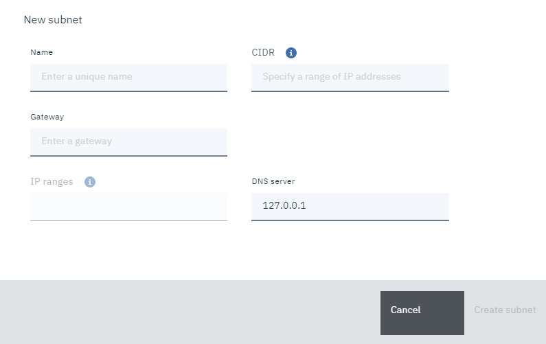

---

copyright:
  years: 2019

lastupdated: "2019-09-26"

keywords: ssh key, AIX virtual machine, configure ssh key, new virtual server, public ssh key, connecting private subnets

subcollection: power-iaas

---

{:shortdesc: .shortdesc}
{:new_window: target="_blank"}
{:codeblock: .codeblock}
{:pre: .pre}
{:screen: .screen}
{:tip: .tip}
{:external: .external}
{:important: .important}

# Configuring a private network subnet
{: #configuring-subnet}

You can configure a private network subnet when you create a {{site.data.keyword.powerSysFull}}. You must give your subnet a **name**, **Classless inter-domain routing (CIDR)**, **Gateway**, **IP range**, and **DNS server**.

For the CIDR, you must specify the exact value of an IP address, `192.168.100.0/24` (192.168.100.14 on a 255.255.255.0 subnet), or a range of IP addresses, `192.168.100.0/22` (192.168.100.0 to 192.168.103.255). When you specify a CIDR, the web console automatically fills the **IP ranges** field.

The **Gateway** value must be outside of the IP range.
{: important}

  {: caption="Figure 5. Configuring a new private network" caption-side="bottom"}

You can also create a private network subnet by using the IBM CLI. Use the following command to create a private network subnet:

```shell
ibmcloud pi network-create-private NETWORK_NAME --cidr-block CIDR --ip-range "startIP-endIP[,startIP-endIP]" [--dns-servers "DNS1 DNS2"] [--gateway GATEWAY] [--json]
```
{: codeblock}

## Using CIDR notation
{: #cidr-notation}

You must use CIDR notation when you choose the IP ranges for your private network subnet.

```shell
<IPv4 address>/number` (VPC address example: `10.10.0.0/16`)
```
{: screen}

CIDR notation is defined in [RFC 1518](https://tools.ietf.org/html/rfc1518){: external} and [RFC 1519](https://tools.ietf.org/html/rfc1519){: external}.
{: note}

You must reserve the last 16 bits (65,536 addresses) of the _IPv4_ as _0s_ to use them for various subnet IP addresses within the same {{site.data.keyword.cloud}} VPC. If you use an IP range outside of those that are defined by [RFC 1918](https://tools.ietf.org/html/rfc1918){: external} (`10.0.0.0/8`, `172.16.0.0/12`, or `192.168.0.0/16`) for a subnet, the instances that are attached to that subnet might not be able to reach parts of the public internet.

The number after the slash represents the bit length of the subnet mask. As a result, the smaller the number after the slash, the **more** IP addresses you are allocating.

The following table lists the number of available addresses in a subnet, based on its specified CIDR block size:

| CIDR block size | Available Addresses |
| --------------- | ------------------- |
|      /22        |        1019         |
|      /23        |         507         |
|      /24        |         251         |
|      /25        |         123         |
|      /26        |          59         |
|      /27        |          27         |
|      /28        |          11         |

## Linking private subnets and networks in a Power System Virtual Server on the IBM Cloud
{: #connecting-subnet}

 You can link private subnets within a colocation (colo) that are on the same virtual LAN (VLAN). You must open a ticket with IBM support to enable this functionality.
