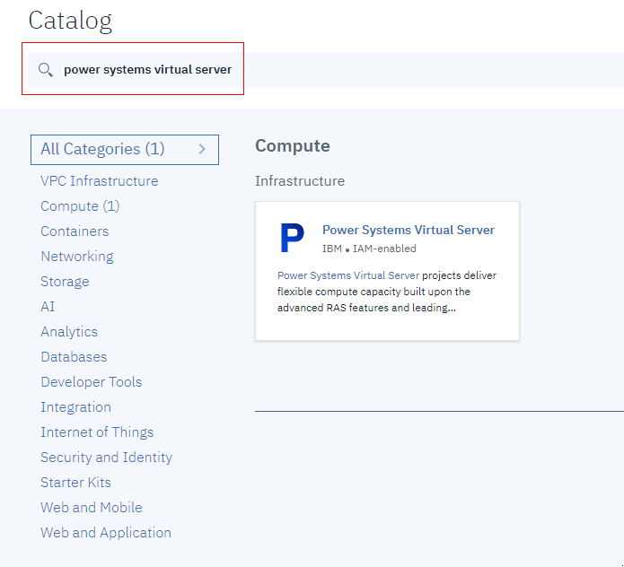
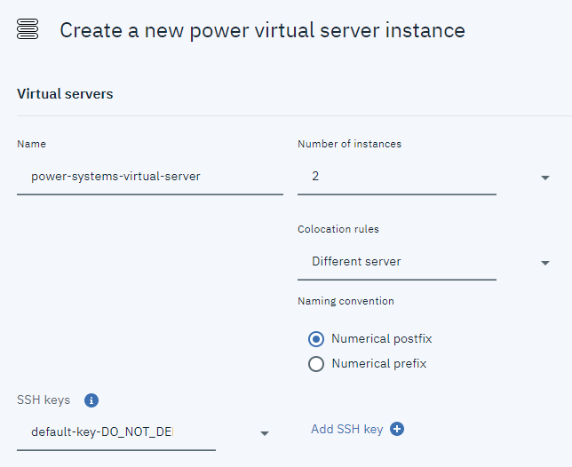
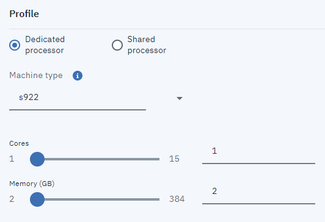
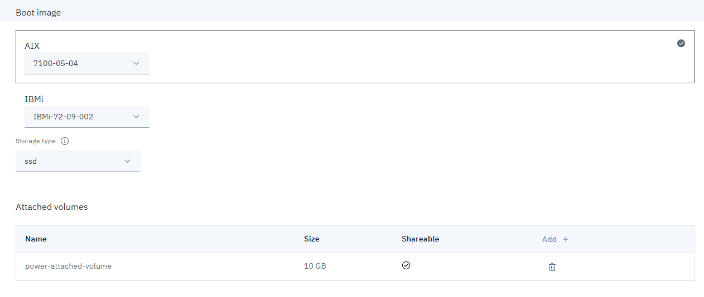

---

copyright:
  years: 2019

lastupdated: "2019-09-26"

keywords: getting started, power systems virtual server, virtual server, creating virtual server

subcollection: power-iaas

---

{:new_window: target="_blank"}
{:shortdesc: .shortdesc}
{:screen: .screen}
{:codeblock: .codeblock}
{:pre: .pre}
{:tip: .tip}
{:note: .note}
{:important: .important}
{:deprecated: .deprecated}
{:external: target="_blank" .external}

# Creating a Power Systems Virtual Server
{: #creating-power-virtual-server}

To create and configure a {{site.data.keyword.powerSysFull}}, complete the following steps:
{: shortdesc}

1. Log in to the [IBM Cloud catalog ](https://cloud.ibm.com/catalog){: new_window} with your IBM Cloud account credentials.

2. In the catalog's search box, type **Power Systems Virtual Server** and click the {{site.data.keyword.powerSys_notm}} tile.

    {: caption="Figure 1. The IBM Cloud catalog" caption-side="bottom"}

3. Give your service a name and choose where you'd like to deploy your {{site.data.keyword.powerSys_notm}} instance.

    {: caption="Figure 2. Selecting a service and region" caption-side="bottom"}

    When you select a region for your service, **Dallas** uses the _DAL13_ data center, while **Washington D.C.** uses the _WDC04_ data center.
    {: note}

4. Click **Create** at the bottom of the webpage.

    {: caption="Figure 3. Creating a Power Systems Virtual Server service" caption-side="bottom"}

5. After you click **Create**, you are redirected to the **Resource List** pane.

6. From the **Resource List**, select your service under **Services** to go to the **Manage** pane.

    {: caption="Figure 4. The IBM Cloud Resource List" caption-side="bottom"}

7. Click **Provision new**.

    {: caption="Figure 5. Provisioning a new Power Systems Virtual Server" caption-side="bottom"}

8. Complete all of the required fields to successfully create a new instance.

      The price is dynamically updated in the **Order Summary** section as you complete the fields to create a {{site.data.keyword.powerSys_notm}} allowing you to easily create a cost-effective {{site.data.keyword.powerSys_notm}} that satisfies your business needs.
      {: tip}

    1. Complete all of the fields under the **Virtual servers** section. If you select more than one instance, you are presented with more options.

      {: caption="Figure 6. Creating a Power Systems Virtual Server instance" caption-side="bottom"}

    1. Select whether you'd like a **Dedicated processor** or a **Shared processor**. Remember to click the wanted **Machine type**, the number of **Cores**, and the amount of **Memory (GB)** as well.

      {: caption="Figure 7. Selecting your processor and system" caption-side="bottom"}

    1. Finally, complete the **Boot volume**, **Attached volumes**, and **Network interfaces** fields as instructed by your organization. When you select **Boot volume**, the IBM Cloud console allows you to select certain stock images and the list of images in your catalog. To see your boot images, go to the **Boot images** tab after provisioning the instance.

      When using an AIX stock image as the boot volume, a console session is required for the initial setting of the root user password. Without completing this step, SSH login appears as being _disabled_. For more information, see [How to create a new AIX VM with SSH keys for root login](/docs/infrastructure/power-iaas?topic=power-iaas-create-vm).
      {: important}

      {: caption="Figure 8. Defining your volumes and network interfaces" caption-side="bottom"}

9. Accept the **Terms of Use** and click **Create** to provision a new {{site.data.keyword.powerSys_notm}}.

The following table provides information about the **Power Sytems Virtual server instance** fields:

<table>
<caption>Table 1. Power Virtual Server instance fields</caption>
<tr>
<th>Field</th>
<th>Description</th>
</tr>
<tr>
<td>Number of Instances</td>
<td>Specify the number of instances that you want to create for the {{site.data.keyword.powerSys_notm}}. If you specify more than one instance, you can select the following naming conventions and colocation rules:
  <dl>
    <dt><strong>No preference</strong></dt>
  <dd>Select this option if you do not have a hosting preference.</dd>
    <dt><strong>Different  Server</strong></dt>
  <dd>Select this option to host each instance on a different server. You can use this option if you are concerned about a single-server outage that might affect all {{site.data.keyword.powerSys_notm}} instances. </dd>
  <dt><strong>Numerical Prefix</strong></dt>
  <dd>Select this option to add numbers before the name of the virtual server. For example, if the first {{site.data.keyword.powerSys_notm}} name is <i>Austin</i> the next name for the virtual instance is <i>1Austin</i></dd>
  <dt><strong>Numerical Postfix</strong></dt>
  <dd>Select this option to add numbers after the name of the virtual server. For example, if the first {{site.data.keyword.powerSys_notm}} name is <i>Rochester</i> the next name for the virtual instance is <i>Rochester1</i>.</dd>
  </dl>
  

  <strong>Note:</strong> When you create multiple instances of the virtual server, you must select <strong>On</strong> from the <strong>Shareable</strong> field for each data volume that you add. If you do not want the data volume to be shareable, you can add the data volume after you create the virtual server.
  

   </td>
</tr>
<tr>
<!-- <td>PIN virtual server</td>
<td>Select <strong>On</strong> to lock the {{site.data.keyword.powerSys_notm}} onto a host system. If you select <strong>On</strong>, the virtual server cannot be moved to a different host. For example, by selecting <strong>On</strong> you would experience an outage during host maintenance.</td>
</tr> -->
<tr>
<td>Machine Type</td>
<td>Specify the machine type. The machine type that you select determines the number of cores and memory that is available. For more information about hardware specifications, see <a href="https://www.ibm.com/downloads/cas/KQ4BOJ3N" target="_blank">S922</a> and <a href="https://www.ibm.com/downloads/cas/EE476WAP" target="_blank">E880</a>.</td>
</tr>
<tr>
<td>Cores</td>
<td>Select the number of cores for the {{site.data.keyword.powerSys_notm}}. If you selected <strong>Shared processor</strong>, you can specify the number of cores by 0.25 increments. For example, valid core values are 0.5, 1.25, and 2.75. A virtual CPU is allocated for every 0.25 entitlement.

If you are concerned about performance issues, you can select <strong>Dedicated processor</strong> because the process is dedicated to your virtual server and is not shared. For more information, see <a href="https://www.ibm.com/developerworks/community/wikis/home?lang=en#!/wiki/Power%20Systems/page/How%20does%20Shared%20Processor%20Performance%20Compare%20to%20Dedicated%20Processors" target="_blank">How does Shared Processor Performance Compare to Dedicated Processors</a>.</td>
</tr>
<tr>
<td>Memory</td>
<td>Select the amount of memory for the {{site.data.keyword.powerSys_notm}}. The amount of memory that you can select depends on the number of cores you selected. For each core that you select, you can allocate up to 64 GB. For example, if you selected four cores you are allowed to select up to 256 GB of memory. </td>
</tr>
<tr>
<td>Create Boot Volume</td>
<td>Select a version of the IBM-provided AIX or IBM i operating system stock image. If you want to bring your own custom image, you must use a supported technology level of the AIX or IBM i operating system image for the Power Systems hardware that you selected in the <strong>Machine Type</strong> field. For more information, see <a href="/docs/infrastructure/power-iaas?topic=power-iaas-deploying-custom-image">Deploying a custom image within a Power Systems Virtual Server</a>.

<strong>Important:</strong> When you use an AIX stock image as the boot volume, a console session is required for the initial setting of the root user password. Without completing this step, SSH login as 'root' appears as being _disabled_.

For IBM i system licensing information, see <a href="/docs/infrastructure/power-iaas?topic=power-iaas-ibmi-lpps">IBM i License Program Products (LPP) and Operating System (OS) feature bundles</a>.

</td>
</tr>
<tr>
<td>Attached Data Volumes</td>
<td>You can either create a new data volume or attach an existing data volume that is already defined in your IBM Cloud account.
<dl>
  <dt><strong>Create Data Volume</strong></dt>
  <dd>Click <strong>Add</strong> to create a new data volume that can be used for more storage for your {{site.data.keyword.powerSys_notm}} instance. If you want to allow multiple instances of {{site.data.keyword.powerSys_notm}} to write data to the same data volume, you must select <strong>On</strong> from the <strong>Shareable</strong> field. </dd>
  <dt><strong>Attach Existing Data Volume</strong></dt>
  <dd>Select an existing data volume for more storage for your {{site.data.keyword.powerSys_notm}} instance. If the list does not display a data volume that you previously used, it might be because that data volume was created with a different IBM Cloud account.</dd>
</dl>
</td>
</tr>
<tr>
<td>Public Networks</td>
<td>Select this option to use an IBM-provided public network. There is a cost that is associated with selecting this option. For more information, see <a href="/docs/infrastructure/power-iaas?topic=power-iaas-about-power-virtual-server#apvs-public-and-private" target="_blank">Public and private networks</a>.
</td>
</tr>
<tr>
<td>Private Networks</td>
<td>Click <strong>Add</strong> to identify a new private network for the virtual server. If you already added a private network, you can select it from the list. For more information, see <a href="/docs/infrastructure/power-iaas?topic=power-iaas-cpn-configuring#cpn-configuring" target="_blank">Configure private network</a>.</td>
</tr></table>
