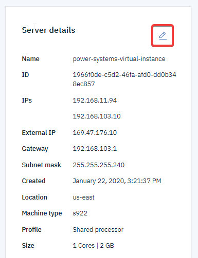
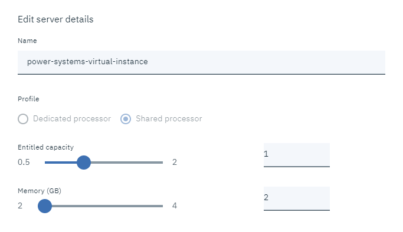
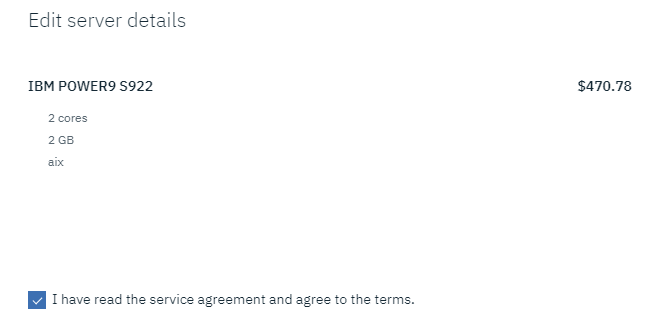
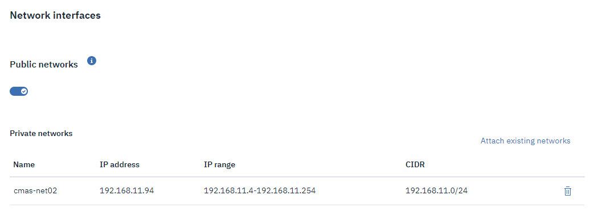
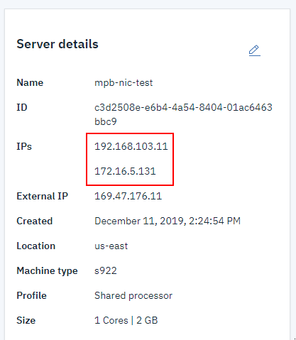
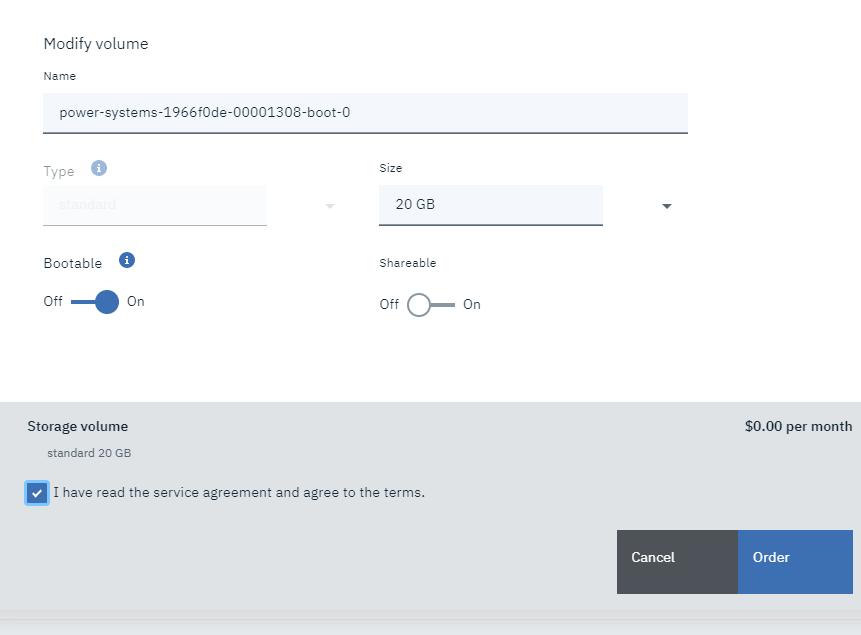
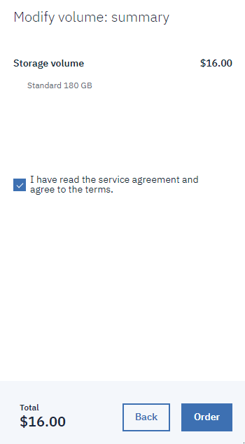

---

copyright:
  years: 2019

lastupdated: "2019-12-13"

keywords: storage volume, new storage size, modifying server, editing volume, volume modification, DLPAR, modifying instance, scaling VM, public network, NIC

subcollection: power-iaas

---

{:new_window: target="_blank"}
{:shortdesc: .shortdesc}
{:screen: .screen}
{:codeblock: .codeblock}
{:pre: .pre}
{:tip: .tip}
{:note: .note}
{:important: .important}
{:deprecated: .deprecated}
{:external: target="_blank" .external}
{:help: data-hd-content-type='help'}
{:support: data-reuse='support'}

# Modifying a Power Systems Virtual Server instance
{: #modifying-server}

Learn how to modify your {{site.data.keyword.powerSysShort}} to better meet your business needs.
{: shortdesc}

## Resizing an instance by using the IBM console
{: #resizing-vm}

To resize a {{site.data.keyword.powerSys_notm}} instance after its [initial creation](/docs/infrastructure/power-iaas?topic=power-iaas-creating-power-virtual-server), complete the following steps:

1. Go to the IBM console's **Virtual server instances** tab and click your instance.

2. Click the **Edit** icon in the **Server details** pane.

    {: caption="Figure 1. Finding your server details" caption-side="bottom"}

3. After you click the **Edit** icon, a menu appears. Use the toggles to change your instance's **Entitled capacity** and **Memory (GB)**. Click **Next.**

    If the VM is inactive, you can change the processor type to **Dedicated** or **Shared** and adjust the amount of memory however you'd like. The minimum and maximum values for **Memory (GB)** and **Entitled capacity** are recalculated based on the type of processor. When you choose to resize an active VM, you cannot change the processor type. The minimum amount of **Memory (GB)** and **Entitled capacity** are half of what was allocated at provisioning time, while their maximum amount is double.
    {: tip}

    {: caption="Figure 2. Modifying your server details" caption-side="bottom"}

4. Check the service agreement box and click **Order** to complete the instance modification process and accept the price.

    {: caption="Figure 3. Ordering your newly modified instance" caption-side="bottom"}

5. To verify your instance modification, view your **Server details**.

## Modifying attached volumes and network interfaces
{: #modifying-volume-network}

You can modify your attached volumes and remove or add a public network.

### Adding or managing a volume

1. To add a volume, click **Add new**.

2. Enter the **Name**, **Type**, and **Size** of the new volume. You can also select whether to make it **Shareable**.

3. Click **Next**, agree to the service agreement, and submit your **Order**.

To attach or detach one or more volumes, click **Manage existing volumes**. Select your wanted volumes and click **Finish**.

If you'd like to change the boot status of a volume, click the **Bootable** toggle.
{: note}

{: caption="Figure 4. Managing your existing volumes" caption-side="bottom"}

### Adding or removing a public network

You can remove or add a public network by clicking the **Public networks** toggle.

You cannot toggle a public network off if there are no other defined networks.
{: note}

{: caption="Figure 5. Toggling a public network on or off" caption-side="bottom"}

 When you toggle a public network off and then on, the IBM console regenerates new internal and external IP addresses. You need to check the IBM console for the new internal IP address (that maps to the **External IP** address). You must add a new NIC and point it to the new internal IP address. For more information, see [How to add or remove a network interface from an AIX virtual machine (VM)](/docs/infrastructure/power-iaas?topic=power-iaas-managing-network-interface)

<!-- {: caption="Figure 6. Adding a public network to an AIX VM" caption-side="bottom"} -->

## Resizing a storage volume by using the IBM console
{: #resizing-volume}
{: help}
{: support}

To resize a {{site.data.keyword.powerSys_notm}} storage volume after its initial creation, complete the following steps:

Resizing is not immediately available after you deploy a virtual machine (VM).
{: important}

1. Go to the IBM console's **Storage volumes** link in the left navigation pane and find your volume.

2. Click the **Edit** icon to the right of your storage volume.

    {: caption="Figure 7. Editing a storage volume" caption-side="bottom"}

3. After you click the **Edit** icon, a menu appears. Select your wanted storage volume size. You can increase the size of only the storage volume. You cannot decrease it.

    {: caption="Figure 8. Modifying your storage volume" caption-side="bottom"}

4. Read the service agreement and agree to the terms. Click **Order** to complete the volume modification process and accept the price.

    {: caption="Figure 9. Ordering your new storage volume" caption-side="bottom"}

5. To verify your new storage size, go back to the **Storage volumes** tab.
