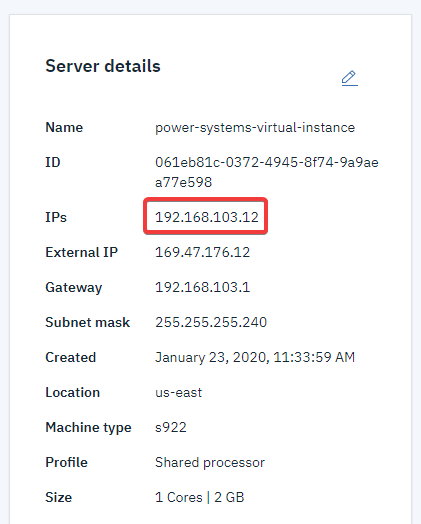

---

copyright:
  years: 2019

lastupdated: "2019-11-18"

keywords: network inteface, AIX cloud VM, ifconfig, detach, en0, rmdev, external IP address

subcollection: power-iaas

---

{:shortdesc: .shortdesc}
{:new_window: target="_blank"}
{:codeblock: .codeblock}
{:pre: .pre}
{:screen: .screen}
{:tip: .tip}
{:important: .important}
{:note: .note}
{:external: .external}
{:help: data-hd-content-type='help'}
{:support: data-reuse='support'}

# How to add or remove a network interface from an AIX virtual machine (VM)
{: #managing-network-interface}

Since IBM PowerVC Version 1.2.2, IBM PowerVC can dynamically add a network interface controller (NIC) to a VM or remove a NIC from a VM. IBM PowerVC does not set the IP address for new network interfaces that are created after the machine deployment. Any removal of a NIC results in freeing the IP address that was set on it.  You must remove and readd the AIX VM network interface if you choose to disconnect the {{site.data.keyword.powerSys_notm}} AIX VM from a public network.
{: shortdesc}

NICs are assigned based on the ordering in which they are specified during creation. To display information about all of the network interfaces in the system, open the AIX console and type `ifconfig -a`.

When you toggle a public network on and off, the IBM console regenerates new internal and external IP addresses. You need to check the IBM console for the new internal IP address to complete this procedure.
{: note}

## Removing a network interface from an AIX VM
{: remove-nic}
{: help}
{: support}

1. Use the `ifconfig` command to remove the network interface from the AIX VM. In the following example, *en0* is the public interface.

    ```
    ifconfig en0 down detach
    ```
    {: codeblock}

2. Next, run the `rmdev` command to remove the device from the AIX system.

    ```
    rmdev -dl en0
    ```
    {: codeblock}

3. Use the `cfgmgr` command to reconfigure the device.

## Adding a network interface to an AIX VM
{: add-nic}

1. To add a *en0* network interface and point it to the new internal IP address (as shown on the IBM console), enter the following command replacing the internal IP address with your own:

    ```
    ifconfig en0 192.168.103.12
    ```
    {: codeblock}

    {: caption="Figure 1. Finding your internal IP address" caption-side="bottom"}
