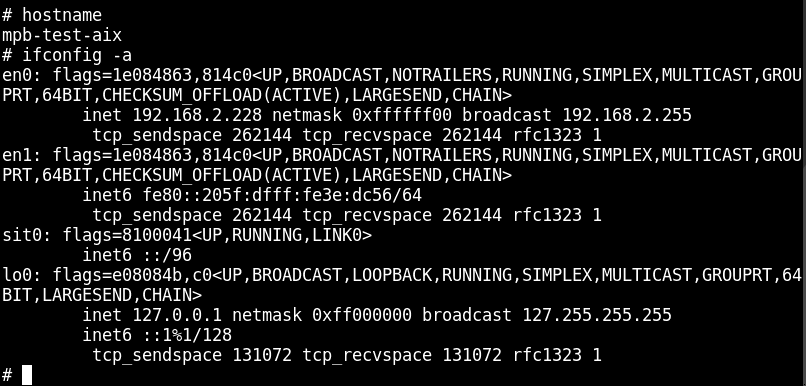

---

copyright:
  years: 2019

lastupdated: "2019-11-18"

keywords: troubleshooting, hung virtual machine, support, help, system management services, SMS

subcollection: power-iaas

---

{:tsSymptoms: .tsSymptoms}
{:tsCauses: .tsCauses}
{:tsResolve: .tsResolve}
{:shortdesc: .shortdesc}
{:codeblock: .codeblock}
{:screen: .screen}
{:tip: .tip}
{:note: .note}
{:new_window: target="_blank"}
{:troubleshoot: data-hd-content-type='troubleshoot'}
{:external: target="_blank" .external}

# Troubleshooting AIX-related issues
{: #troubleshoot-iaas-aix}

Learn how to troubleshoot {{site.data.keyword.powerSysShort}} AIX-related issues. **This page is still under construction!**
{: shortdesc}

## What can I do if my AIX virtual machine (VM) does not initially boot?
{: #troubleshoot-hung-aix}
{: troubleshoot}

{: tsSymptoms}
The AIX boot disk being used to provision an AIX VM is not successfully booting. As a result, the console displays a blank screen without standard debugging options.

{: tsCauses}
The AIX boot disk might be corrupted.

{: tsResolve}
If the AIX VM does not boot, you must provision an additional AIX VM and use it as a Network Installation Management (NIM) server. Without a NIM server, you cannot debug the boot issue and must re-image your disk.

1. Determine the hostname and IP address of the system by using the following two commands, `hostname` and `ifconfig -a`.

    {: caption="Figure 1. Determining your hostname and IP address" caption-side="bottom"}

2. Using the information from the previous step, add an entry for your hostname and IP address into `/etc/hosts`. For example, `echo "192.168.0.15 aix-7100-05-04" >> /etc/hosts`.

3. Run the following command, `nim_master_setup -a device=/usr/sys/inst.images -a mk_resource=no`.

    {: caption="Figure 2. Creating a NIM master" caption-side="bottom"}

4. Once completed, the NIM master fileset will have been installed and the basic resource objects created. The administrator is now able to add additional nim clients and define resources.

    {: caption="Figure 3. NIM master installation summary" caption-side="bottom"}

For more information on setting up a NIM server, see [Setting up NIM to boot into maintenance mode](https://www.ibm.com/support/pages/setting-nim-boot-maintenance-mode){: new_window}{: external}. If you are unfamiliar with this process, create a [new support case](/docs/infrastructure/power-iaas?topic=power-iaas-getting-help-and-support).
